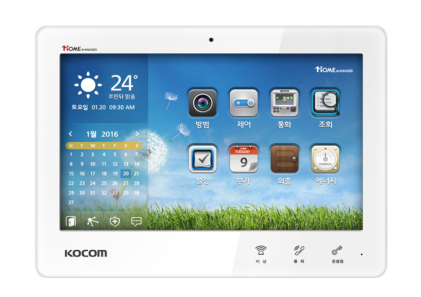

# Swift Kocom Wallpad

## About

- Home Assistant에서 Kocom 월패드를 제어하는 프로그램입니다.

- TCP/IP 소켓으로 받아온 Kocom 월패드의 RS-485 시리얼 데이터를 Home Assistant MQTT integration로 연결합니다.

## Features

- 방 #1(거실), #2(침실) 난방 제어

- 전열교환기 제어

## Requirement

- Ubuntu 24.04 LTS(Noble Numbat), Swift 6.0 가상 환경에서 빌드됩니다.

## Docker 환경변수 설정

- ``RS485_HOST``: RS-485 패킷을 받아올 호스트(ex. 192.168.0.100)

- ``RS485_PORT``: RS-485 호스트 연결 포트(ex. 8899)

- ``MQTT_HOST``: MQTT 브로커 호스트(ex. 192.168.0.200)

- ``MQTT_PORT``: MQTT 브로커 호스트 연결 포트(ex. 1883)

- ``MQTT_USERNAME``: MQTT 브로커 사용자 이름

- ``MQTT_PASSWORD``: MQTT 브로커 비밀번호

## 이미지

- ``linux/amd64`` (Synology NAS)용 이미지가 배포되어 있습니다.

- <https://hub.docker.com/r/nrurnru/swift-kocom-wallpad>

## License

swift-kocom-wallpad is released under the MIT license. [See LICENSE](https://github.com/nrurnru/swift-kocom-wallpad/blob/master/LICENSE) for details.
